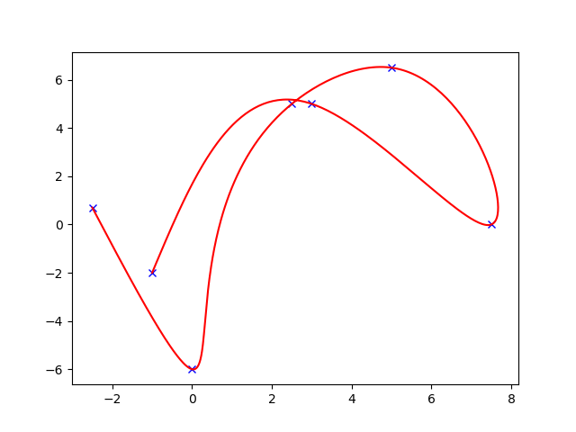
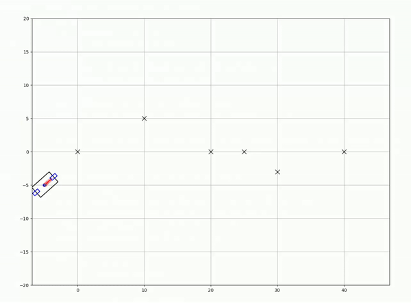

# MPC-Driving: 2D Car Driving Simulation with Model Predictive Control (MPC)


This project implements a simulation of a car driving in a 2D environment using **Model Predictive Control (MPC)** for trajectory planning and control. Visualization is handled via **matplotlibcpp**, providing real-time graphical feedback.


## Introduction
Model Predictive Control (MPC) is a powerful optimization-based control strategy widely used in autonomous systems. This project demonstrates its application for controlling a car in a 2D simulation. The car follows a predefined trajectory while considering constraints such as velocity limits, obstacle avoidance, and steering limits.

## Features
- **2D environment simulation** with realistic vehicle Model.
- **MPC implementation** for optimal control.
- **CubicSpline for trajectory generation** to create smooth paths.
- **Visualization** using matplotlibcpp for real-time feedback.
- Easily configurable parameters for testing different scenarios.


## Option1: Getting Started on Devcontainer (Recommended)
This repository is configured with a `devcontainer` for Visual Studio Code, allowing you to quickly set up and use the development environment using Docker.

### 1. Clone the Repository
```bash
git clone https://github.com/CMaybe/MPC-Driving.git
cd MPC-Driving
code .
```
### 2. Open in VSCode

Open the cloned repository in Visual Studio Code. VSCode will detect the devcontainer configuration and prompt you to reopen the folder in the container.

### 3. Reopen in Container

Follow the prompt to reopen the repository in the Docker container. VSCode will build and start the container as defined in the .devcontainer directory, setting up the development environment according to the configuratio.

#### (Option: Access the Container Directly)
If you prefer to access the container directly, you can use the following command:

```bash
xhost +local:docker
docker exec -it dev-mpc-driving /bin/bash
```

## Option2: Installation
To set up the project locally, follow these steps:

### 1. Clone the repository:
   ```bash
   git clone https://github.com/CMaybe/MPC-Driving.git
   cd MPC-Driving.git
   ```

### 2. Install the required dependencies
- **C++ Compiler**: Ensure you have a **C++17 compatible compiler** installed. Examples include GCC 7.1+ or Clang 5.0+.
- **matplotlibcpp**: Follow the [installation guide](https://github.com/lava/matplotlib-cpp) to set it up.
- **Eigen**: Install Eigen for matrix operations. You can use your package manager (e.g., `apt`, `brew`) or download it from the [official site](https://eigen.tuxfamily.org/).
- **Ipopt** : Ipopt (Interior Point OPTimizer) is a popular optimization solver used for large-scale nonlinear optimization problems. download it from [official_site](https://github.com/coin-or/Ipopt).
## Examples
### 1.Spline
An example using **CubicSpline** for trajectory generation is included in the repository. You can find it in the `examples` directory:

```bash
cd MPCDriving/examples/spline
mkdir build && cd build
cmake ..
make
# run
./spline_example 
```
#### Result



### 2.MPC
An example using **MPC** for path following is included in the repository. You can find it in the `examples` directory:

```bash
cd MPCDriving/examples/mpc
mkdir build && cd build
cmake ..
make
# run
./mpc_example 
```
#### Result




## WIP ...
## TODO
- [X] **Optimize computational efficiency** for real-time performance.
- [X] **Improve visualization** with additional metrics (e.g., control inputs, predicted trajectory).
- [X] **Update ReadMe** for advanced simulations.
- [ ] **Implement obstacle avoidance** in the MPC formulation.
- [ ] **Add support for System obstacles** to enhance realism.
